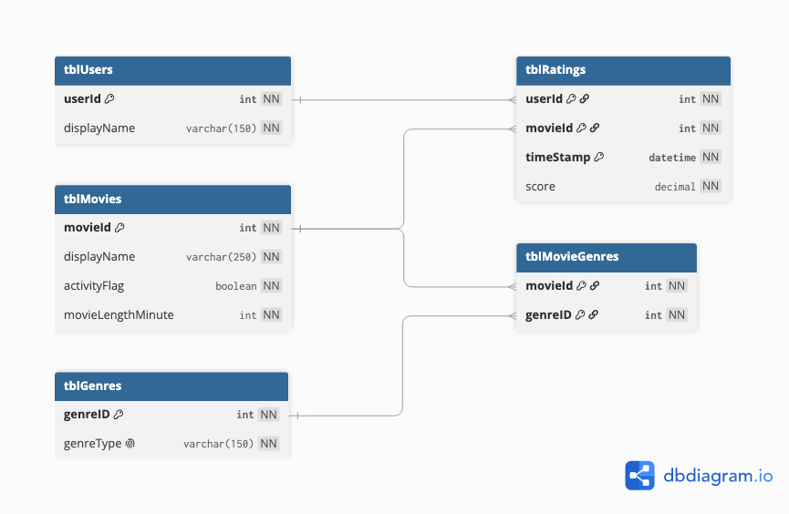

# 603-movie-databse

This database theme is movies and it will hold user, movies, genres and rating data. 

The platform that will be built based on this database will be a web application that will allow users to rate movies. This system must be able to handle the following questions. What is the highest rated movie? What is the highest rated movie by time frame? What movies are trending? These questions will all be answered with one analytic view for the user. On this page it will allow users to apply filters that the backend application would then pass to SQL. The filters will be time related, and a filter between if it is trending or the sorted by rank.

The other questions that users will want to know is what movies should I watch. The way we will answer this is by providing the users a list of movies that are similar in genre. Or if they want to know a list of movies that are less than 120 minutes this can also be provided. With the filters that the user has, the user will be able to create a view that fits their needs. 

